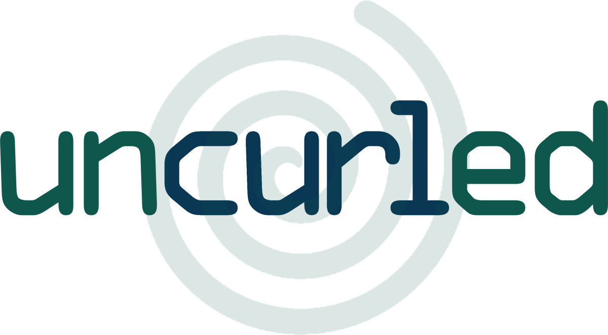

# Uncurled

**Uncurled** - everything I know and learned about running and maintaining Open
Source projects for three decades.

I have been actively involved in Open Source development since the early 1990s
when I discovered the phenomenon of people writing source code they give away
freely for others to use and modify under a certain license.
